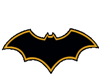

<h2 align="center">👋 Hi, I’m Hiran Das 

</h2> 
<h2 align="center">
“All this – it’s not me, inside, I am … more.” 

</h2>

- 👀 I’m interested in learning new Tech and contributing to opensource projects.
- 🌱 I’m currently learning RUST as it is the new growing kid on the block and also piping into different frameworks as well as Infra tools.
- 💞️ I’m looking to collaborate on any opensource project that looks interesting to me
  
<h2 align="center">
 📫 
</h2>

<h2>My SKILLS</h2>

  
<h2>Languages</h2>

  

  
  
  

  
<h2>Frameworks</h2>

  

  
  

    
  

  
<h2>Databases</h2>

  

  

  
<h2>Productivity Tools</h2>

  

  
  
  
  
  

  
<h2>Git Platforms</h2>

  

  

  
<h2>Operating Systems</h2>

  

  
  
   
  

  
<h2>Other Tools</h2>

  

  
  
  

